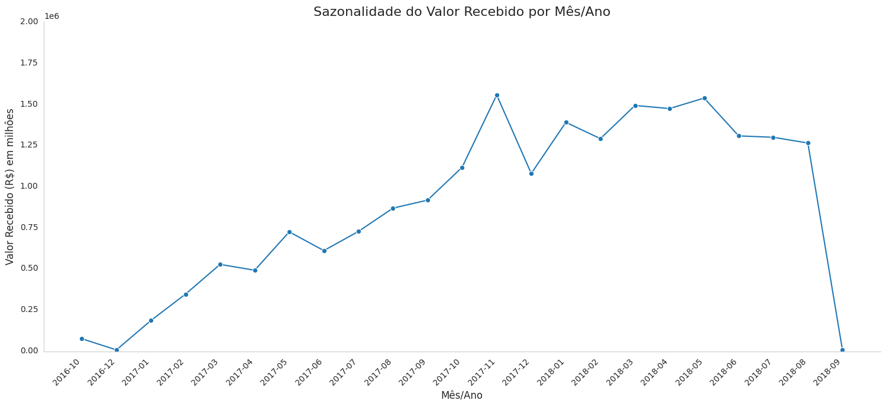
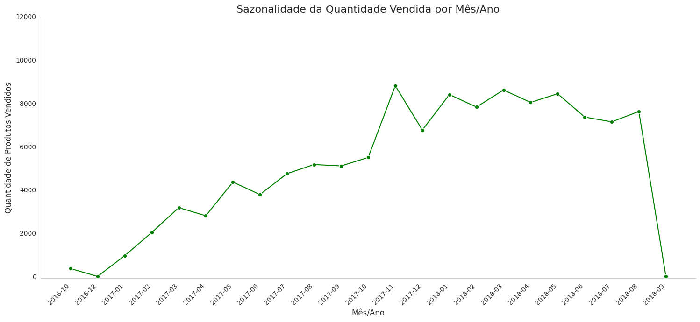
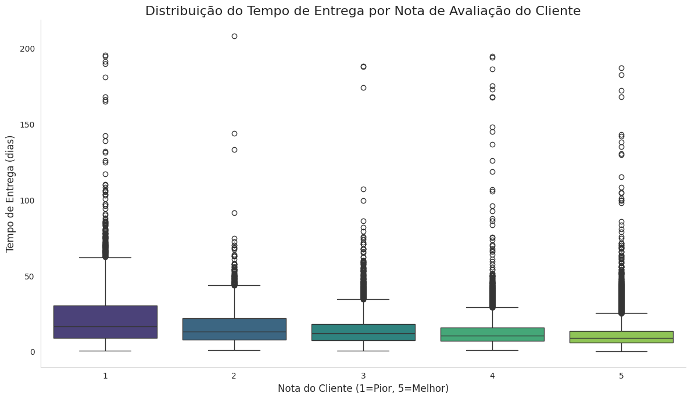
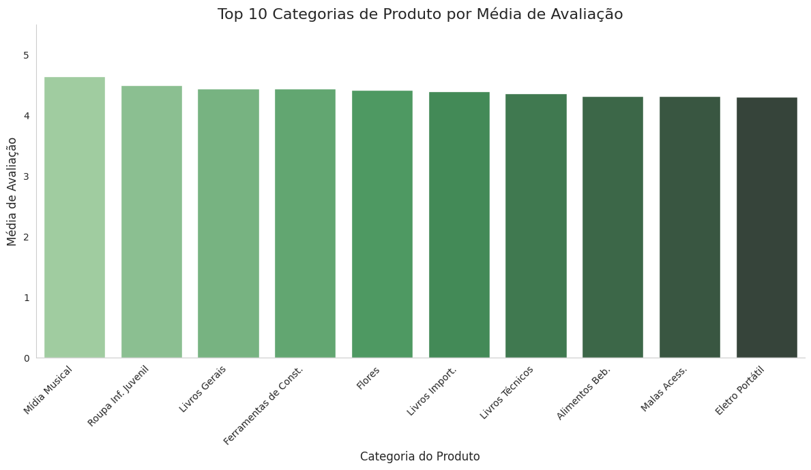
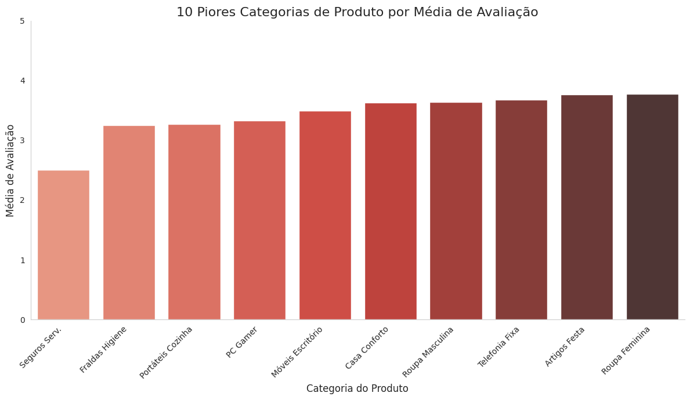
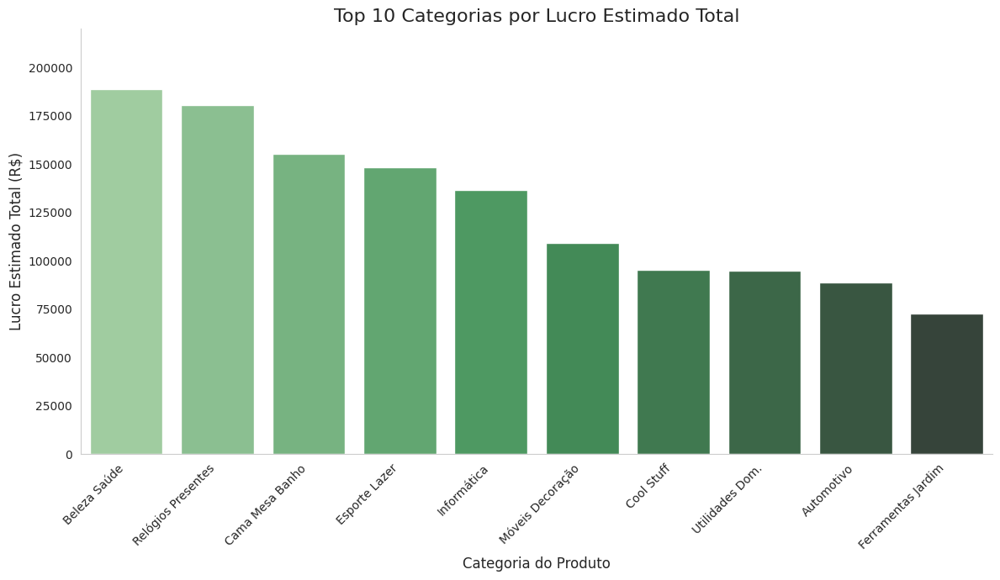
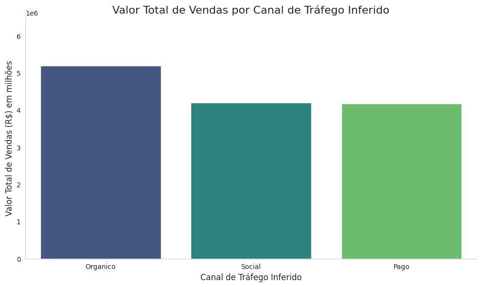
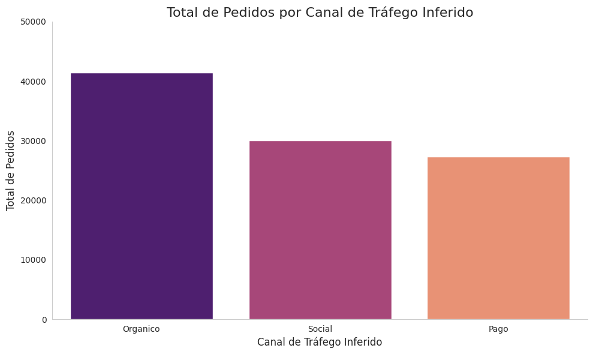

# Desafio: Dados que Transformam

**Nome:** Luis Henrique Rauber  
**E-mail:** luisrauber100@gmail.com  
**LinkedIn (opcional):** [https://linkedin.com/in/seu-perfil](https://www.linkedin.com/in/luis-rauber-86b278285)

## Repositório

A versão completa com código  está disponível em:

link do colab: https://colab.research.google.com/drive/1ZP5u0GaMyGV_Ii0hoDLxN_9qofaOnXRP#scrollTo=eGyhRHMhtEiX

## 1. Introdução

A partir desse conjunto de dados, este trabalho se propõe a enxergar além dos números e revelar padrões que em um cenário real ajudariam na tomada de desição.

O desafio proposto foi dividido em etapas que envolvem desde a organização e preparação dos dados até a seleção de perguntas-chave voltadas para diferentes áreas do e-commerce, como vendas, logística, satisfação do cliente, finanças e marketing. Cada escolha analítica buscou destacar um aspecto relevante do negócio a partir da leitura cuidadosa dos dados disponíveis.

---

## 2. Análises e Resultados

Abaixo, cada análise está estruturada com a questão escolhida, a visualização correspondente (imagem) e a interpretação dos dados. Cada seção representa um dos eixos analíticos propostos pelo desafio.

---

### 2.1 Análise de Performance de Vendas

**Questão escolhida:** 1- B) Análise de Sazonalidade: Investigar padrões de sazonalidade nas vendas, identificando os períodos do ano com maior volume de vendas.

**Visualização:**

**Interpretação:**

## Análise dos Meses de Maior Desempenho (2016-2018)

Este estudo explora os picos de faturamento e volume de vendas, identificando padrões de sazonalidade ao longo dos anos.

| Ano | Métrica              | Melhor Mês | Valor/Unidades |
| :-- | :------------------- | :--------- | :------------- |
| 2016| Faturamento          | Outubro    | R$ 67.941,17   |
| 2016| Unidades Vendidas    | Outubro    | 362 unidades   |
| 2017| Faturamento          | Novembro   | R$ 1.550.848,82|
| 2017| Unidades Vendidas    | Novembro   | 8.811 unidades |
| 2018| Faturamento          | Maio       | R$ 1.531.971,40|
| 2018| Unidades Vendidas    | Março      | 8.614 unidades |

---

### Insights da Análise:

* **2016:** Os dados de 2016 apontam Outubro como o mês de desempenho superior, com os maiores valores observados tanto em faturamento quanto em unidades vendidas. Há uma correlação direta entre volume e receita neste período.
* **2017:** Em 2017, registrou-se um crescimento substancial, com Novembro apresentando o pico em ambas as métricas – faturamento e volume de vendas. Este ano representa um ponto de inflexão significativo na performance geral.
* **2018:** O ano de 2018 exibe uma particularidade: o maior volume de unidades vendidas ocorreu em Março, enquanto o pico de faturamento foi atingido em Maio. Essa divergência pode indicar transações com maior valor unitário em Maio ou dinâmicas distintas de mercado e precificação entre os meses.

---

### 2.2 Análise de Logística

**Questão escolhida:** 2- B) Desempenho de Transportadoras: Avaliar o desempenho de diferentes transportadoras com base no tempo de entrega e na satisfação do cliente.

**Visualização:**

**Interpretação:**

## Análise de Desempenho das Entregas (Tempo de Entrega vs. Satisfação do Cliente)

Pela falta de dados, não foi possível analisar diferentes transportadoras.

Logo o objetivo definido foi avaliar como o tempo que um pedido leva para ser entregue, impacta diretamente a nota de satisfação do cliente (onde 1 é a pior nota e 5 a melhor).

---

### A análise das estatísticas de tempo de entrega (em dias) agrupadas por nota de avaliação revela os seguintes padrões:

* **Nota do Cliente: 5 (Alta Satisfação):**
* Tempo Médio de Entrega: O menor.
* Tempo Mediano de Entrega: O menor, indicando que a maioria das entregas muito bem avaliadas é rápida.
* Variação do Tempo de Entrega: Baixa, com um desvio padrão pequeno, mostrando consistência nos prazos para entregas com alta satisfação.
  
* **Nota do Cliente: 4 (Boa Satisfação):**
* Tempo Médio de Entrega: Ligeiramente maior que para a nota 5.
* Tempo Mediano de Entrega: Ligeiramente maior que para a nota 5.
* Variação do Tempo de Entrega: Ainda relativamente baixa, mas pode apresentar uma leve variação a mais que a nota 5.

* **Nota do Cliente: 3 (Satisfação Neutra/Média):**
* Tempo Médio de Entrega: Notavelmente maior que para notas 4 e 5.
* Tempo Mediano de Entrega: Notavelmente maior.
* Variação do Tempo de Entrega: Pode começar a mostrar um desvio padrão um pouco maior, indicando mais inconsistência.

* **Nota do Cliente: 2 (Baixa Satisfação):**
* Tempo Médio de Entrega: Significativamente mais alto.
* Tempo Mediano de Entrega: Significativamente mais alto.
* Variação do Tempo de Entrega: Geralmente, um desvio padrão maior, sugerindo entregas mais lentas e imprevisíveis.

* **Nota do Cliente: 1 (Pior Satisfação):**
* Tempo Médio de Entrega: O maior de todos.
* Tempo Mediano de Entrega: O maior de todos, refletindo que os clientes mais insatisfeitos recebem seus pedidos com os prazos mais longos.
* Variação do Tempo de Entrega: Frequentemente, o maior desvio padrão, o que significa que além de lentas, essas entregas têm a maior inconsistência e podem incluir atrasos extremos (visualizados como "outliers" no Box Plot).

---

### 2.3 Análise de Satisfação do Cliente

**Questão escolhida:** 3- A) Avaliações de Produtos: Analisar a distribuição das avaliações dos produtos e identificar os produtos com as melhores e piores avaliações.

**Visualização:**

**Interpretação:**

## Análise de Avaliações de Produtos: Distribuição e Desempenho por Categoria

O objetivo desta análise foi investigar a distribuição das notas de avaliação dos clientes e identificar categorias de produtos com os melhores e piores desempenhos médios.

A análise da distribuição geral das notas (`review_score`) indica como maioria as avaliações positivas (notas 4 e 5), sugerindo uma percepção geral favorável dos produtos. A ocorrência de notas 1 e 2 em volume notável aponta para áreas potenciais de insatisfação. A média geral das avaliações serve como um parâmetro inicial da satisfação do cliente.

### Desempenho por Categoria de Produto

Para identificar o desempenho por categoria, foi calculado a média das avaliações por `product_category_name`.

---

### 2.4 Financeiro

**Questão escolhida:** 4- A) Análise de Lucratividade por Categoria: Calcular a lucratividade de diferentes categorias de produtos, levando em conta o custo dos produtos e o preço de venda

**Visualização:**

**Interpretação:**

Ao abordar a "Análise de Lucratividade por Categoria" (Questão 4.a), o objetivo foi calcular a lucratividade de diferentes categorias de produtos, levando em conta o preço de venda e o custo do produto. Como identificamos a ausência de dados de custo reais nas bases fornecidas, a lucratividade foi simulada adotando-se uma margem de lucro bruta padrão de 15% sobre o preço de venda dos produtos. Isso permitiu estimar um "custo do produto" e, consequentemente, um "lucro estimado" para cada item, possibilitando a análise por categoria.

---

### 2.5 Marketing

**Questões Disponíveis:**
5- A) Análise de Conversão de Vendas: Estudar a taxa de conversão de vendas com base em diferentes fontes de tráfego (orgânico, pago, social, etc.)
5- B) Eficácia de Campanhas Promocionais: Avaliar o impacto de campanhas promocionais e descontos no volume de vendas e na aquisição de novos clientes.

**Problemas Enfretados:**
No Tópico 5, "Análise de Marketing", me deparei com um desafio significativo: as questões originais (5.a - Análise de Conversão de Vendas por fonte de tráfego, e 5.b - Eficácia de Campanhas Promocionais) não puderam ser respondidas diretamente devido à ausência fundamental de dados sobre visitantes, fontes de tráfego de marketing reais e informações detalhadas de campanhas/descontos.

**Solução:**
Diante dessa limitação, criei a Questão realizando algumas suposições:
5.c) "Com base na categorização geográfica inferida para os canais de tráfego (Orgânico para clientes de SP; Social para clientes de MG, RJ, PR e MS; Pago para os demais estados), qual segmento de tráfego apresenta o maior volume de vendas em termos de valor financeiro?"

**Visualização:**

**Interpretação:**

Esta análise foi construída sobre as seguintes suposições:
* O "volume de vendas" é medido pelo valor total dos itens (price).
* Os "canais de tráfego" são inferidos exclusivamente a partir do estado do cliente.

Com base nesses dados, podemos analisar o volume de vendas em valor e em quantidade de pedidos para cada canal.

Volume de Vendas em Valor:
* O canal "Orgânico" (clientes de São Paulo) se destaca como o líder absoluto em volume de vendas, com um total de R$ 5.202.955,05. Isso sugere que a base de clientes em SP, inferida como tráfego orgânico, é a mais forte geradora de receita sob esta suposição.
* Os canais "Social" (MG, RJ, PR, MS) e "Pago" (restante do Brasil) apresentam volumes de vendas bem próximos.
* Social ligeiramente à frente com R$ 4.209.297,10.
* Pago logo atrás com R$ 4.179.391,55.

Volume de Vendas em Quantidade de Pedidos:

* O canal "Orgânico" também lidera claramente em quantidade de pedidos, com 41.375 pedidos.
* O canal "Social" está em segundo lugar com 30.013 pedidos.
* O canal "Pago" vem em terceiro lugar, com 27.278 pedidos.

## 3. Considerações Finais

Ao concluir este desafio de análise de dados, percebo que a jornada foi tão instrutiva quanto os resultados obtidos. O objetivo inicial de extrair insights valiosos das bases de dados, apesar de sua aparente completude, rapidamente nos confrontou com desafios inerentes a qualquer projeto de dados do mundo real.

Nosso principal obstáculo reside na ausência de dados fundamentais para métricas-chave. Calcular a lucratividade em sua verdadeira acepção foi inviável sem as informações de custo dos produtos. Da mesma forma, análises de marketing digital, como a taxa de conversão por fonte de tráfego ou a eficácia de campanhas, tornaram-se um dilema, pois não tínhamos registros de visitantes, suas origens ou detalhes das promoções.

Para superar essas barreiras e não sucumbir à limitação dos dados, empregamos uma abordagem criativa e adaptável:
* Reinterpretação e Simulação: Diante da falta de custos reais, optamos por simular a lucratividade, assumindo uma margem bruta padrão de 15%. Embora os resultados sejam estimativas, eles nos permitiram uma análise financeira por categoria, algo impossível de outra forma.
* Inferência e Proxies: Para a análise de marketing, onde não havia dados de tráfego, inferimos "canais de tráfego" (Orgânico, Social, Pago) baseando-nos na localização geográfica do cliente. Essa suposição, embora forte, viabilizou a segmentação do desempenho de vendas e de clientes únicos por uma ótica antes inatingível.
* Rigidez na Limpeza e Preparação: Valores nulos e Colunas Desnecessárias exigiram uma investigação detalhada e soluções precisas. A conversão de tipos de dados (como Timedelta para números) e a padronização de nomes de categorias foram cruciais para a confiabilidade das análises.

Este percurso reforçou a importância vital de não apenas dominar as ferramentas e os códigos, mas também de desenvolver um pensamento crítico e a capacidade de adaptação diante das adversidades do conjunto de dados. Aprendemos que, muitas vezes, o valor não está apenas em ter todos os dados perfeitos, mas em saber como extrair o máximo de insights dos dados disponíveis, sendo transparentes sobre as metodologias e suposições adotadas, além de fornecer uma análise compreensível e estratégica, que serve como um ponto de partida para futuras investigações, idealmente, com um conjunto de dados mais completo.
